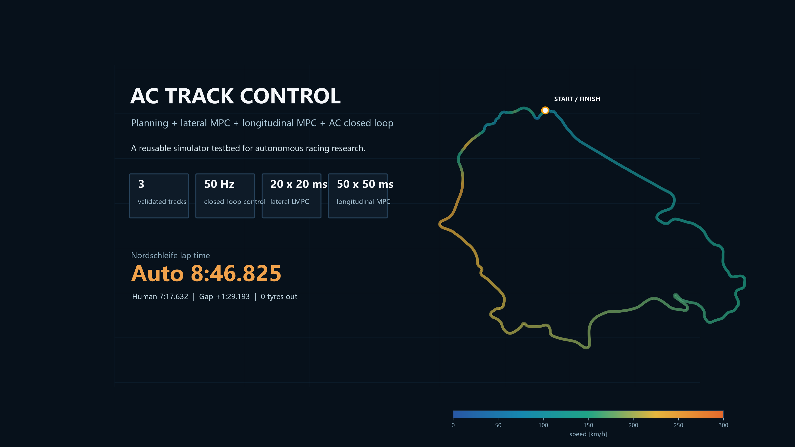
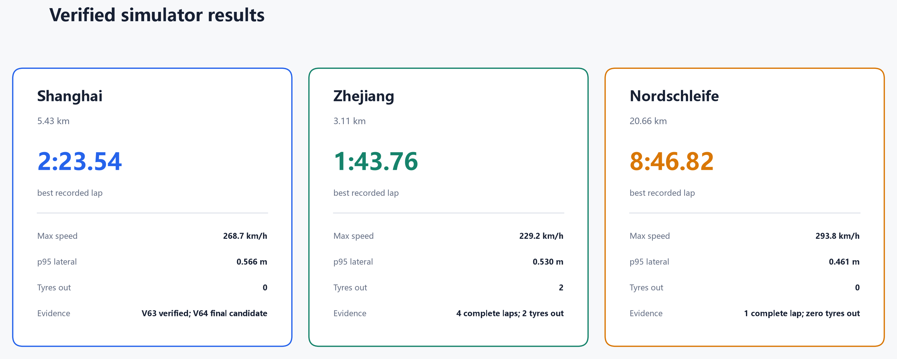
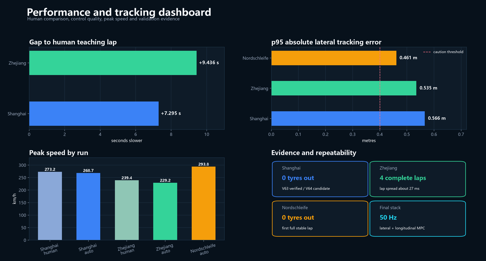
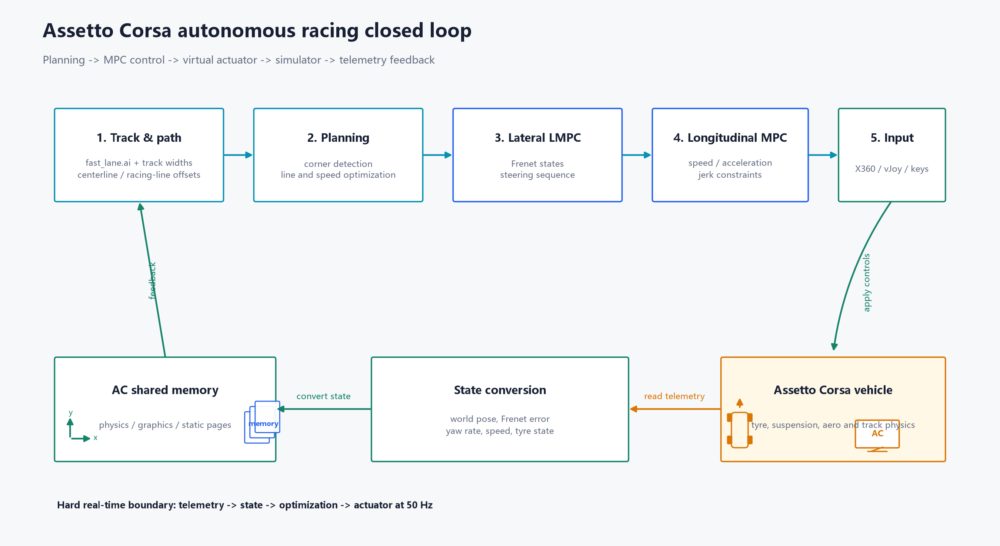
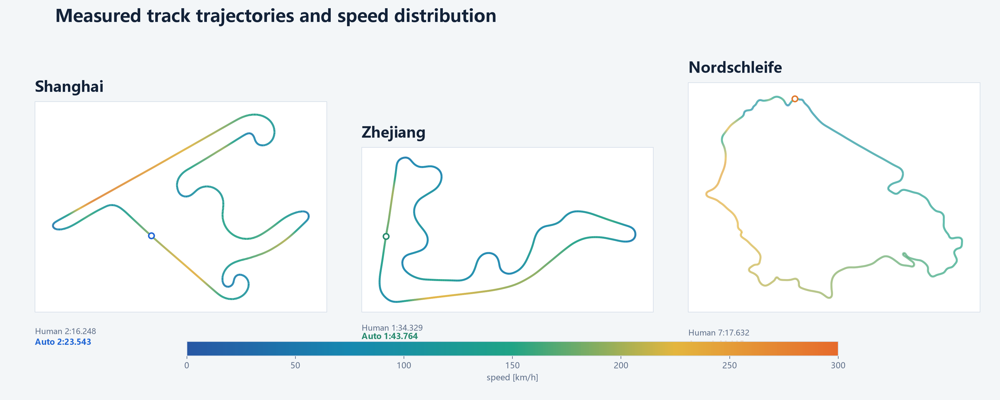
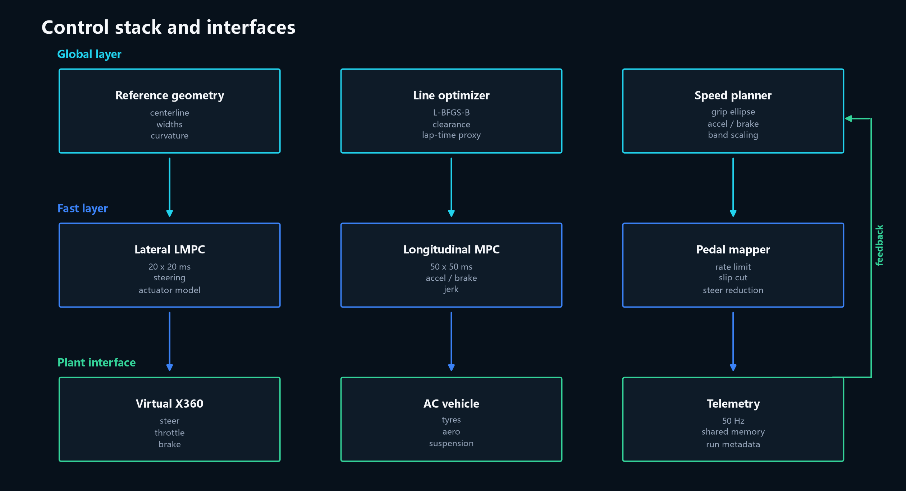
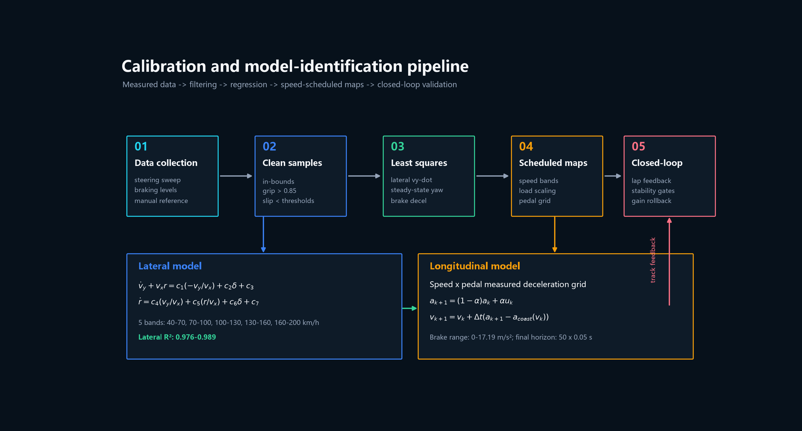

<h1 align="center">AC TRACK CONTROL</h1>

<p align="center">
  Planning + lateral MPC + longitudinal MPC + AC closed loop
</p>

<p align="center">
  A reusable simulator testbed for autonomous racing research.
</p>

<p align="center">
  
</p>

<p align="center">
  
  
  
  
  
</p>

<p align="center">
  <b>Assetto Corsa 赛车自动驾驶规划与控制闭环</b><br>
  共享内存遥测、Frenet 路径跟踪、横向 LMPC、纵向加速度 MPC、赛车线优化与速度包络规划
</p>

项目目标不是做一个“键盘自动驾驶 demo”，而是把赛车自动驾驶中真正需要打通的环节做成可复用工程：实时状态接口、模型辨识、速度与制动标定、路径规划、MPC 控制、日志复盘和赛道结果验证。

## Product specs

<p align="center">
  
  
  
  
</p>

## Verified results

<p align="center">
  
  
  
  
  
  
</p>

| Track | Human | Auto | Gap | Auto max speed | Tyres out | Status |
| --- | ---: | ---: | ---: | ---: | ---: | --- |
| Shanghai | 136.248 s | 143.543 s | +7.295 s | 268.7 km/h | 0 | V63 verified; V64 final candidate |
| Zhejiang | 94.329 s | 103.764 s | +9.436 s | 229.2 km/h | 2 | V59 speed strategy; Shanghai longitudinal MPC synchronized |
| Nordschleife | 7:17.632 | 8:46.825 | +1:29.193 | 293.8 km/h | 0 | V2 safe candidate |





The V64 Shanghai configuration and the synchronized Zhejiang configuration are
the frozen deployment candidates. The lap-time evidence above comes from the
corresponding verified baselines; see `configs/final/manifest.json` for the
exact mapping.

## Visual overview





## What is implemented

- Standard AC shared-memory telemetry for physics, graphics and static pages.
- 50 Hz closed-loop control through a virtual Xbox controller.
- Frenet-frame lateral linear MPC with a speed-scheduled dynamic bicycle model.
- Steering actuator, lead, lag, rate and jerk compensation.
- Longitudinal acceleration MPC with speed, acceleration and jerk costs.
- Measured throttle/brake mapping and a speed-dependent braking response table.
- Fast-lane geometry, track widths, racing-line offsets and edge clearance.
- Curvature-based speed limits, acceleration/braking passes and per-track gain tables.
- High-speed braking lead compensation and a scaled-speed lateral grip cap.
- CSV run logs, lap summaries, segment analysis and figure generation.





## Repository layout

```text
actc/                    Planning, controllers, MPC and simulator interfaces
configs/final/           Frozen track configurations and provenance manifest
configs/models/          Identified vehicle model used by final launchers
tools/                   Launchers, calibration, analysis and figure scripts
tests/                   Focused regression tests
assets/figures/          Public project figures
assets/data/             Reproducible comparison metrics
docs/                    Technical report, quick start and transfer notes
```

## Quick start

Requirements: Windows, Assetto Corsa, Content Manager, Python 3.11+, and
ViGEmBus/vgamepad.

```powershell
python -m venv .venv
.\.venv\Scripts\Activate.ps1
python -m pip install -r requirements.txt
python -m unittest discover -s tests -v
```

Prepare the virtual controller:

```powershell
python -m actc.prepare_input --x360
```

Launch one of the final candidates:

```powershell
.\tools\start_v64_shanghai.ps1
.\tools\start_zhejiang_final.ps1
.\tools\start_nordschleife_v2_safe.ps1
```

Read `docs/QUICKSTART.md` for the complete workflow.

## Documentation

- [Technical report](docs/TECHNICAL_REPORT.md)
- [Figure gallery](docs/FIGURES.md)
- [Paper-style MPC equations](docs/assets/build/mpc_equations.pdf)
- [Quick start](docs/QUICKSTART.md)
- [Verified results](docs/RESULTS.md)
- [Real-car transfer](docs/REAL_CAR_TRANSFER.md)
- [Final configuration manifest](configs/final/manifest.json)

## Model details

- [Lateral model replay validation](assets/figures/model_replay_comparison.png)
- [Longitudinal throttle and brake maps](assets/figures/longitudinal_maps.png)
- [MPC weight scheduling](assets/figures/weight_schedules.png)
- [Coupled speed planning](assets/figures/coupled_speed_planning.png)
- [Lateral model identification](assets/figures/model_identification.png)
- [Linear model and actuator matrices](assets/figures/mpc_equations_page-3.png)

## Key limitations

- The public repository excludes raw run logs and the vendored acados tree.
  The checked-in figures and manifest preserve the verified evidence.
- Zhejiang has the final speed strategy and synchronized longitudinal MPC
  parameters, but the synchronized `50 x 0.05 s` setup has not been re-run.
- Nordschleife V2 is a safe candidate, not a lap-time-optimized final version.
- The project is simulator-only and is not a production vehicle controller.

## Project lineage

The project evolved from basic speed/heading control into a full racing stack:
shared-memory bring-up, steering and pedal calibration, LQR/Stanley baselines,
lateral LMPC, longitudinal calibration, longitudinal MPC, per-track speed
scaling, racing-line safety constraints and Nordschleife validation.

This project is not affiliated with Kunos Simulazioni or Assetto Corsa.
