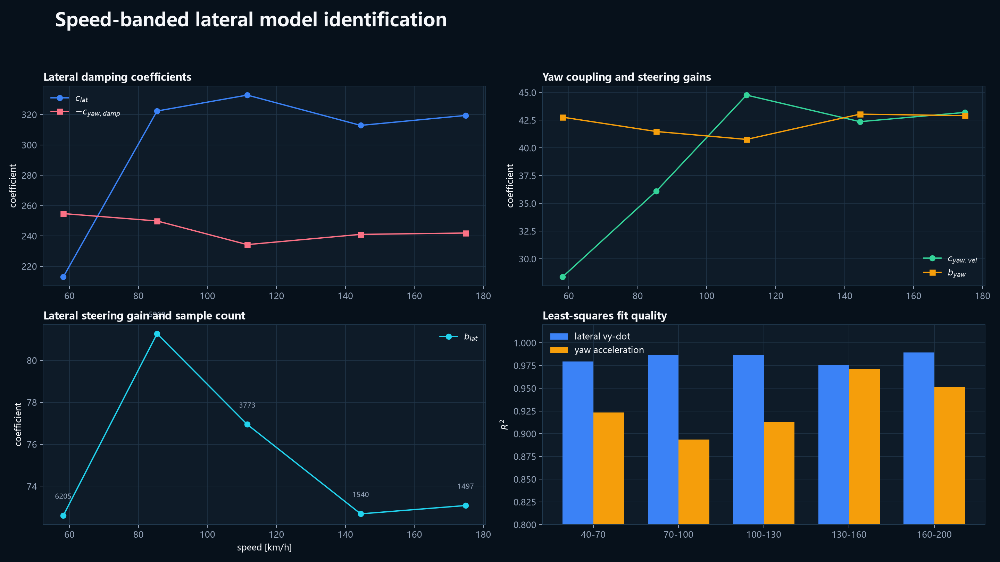
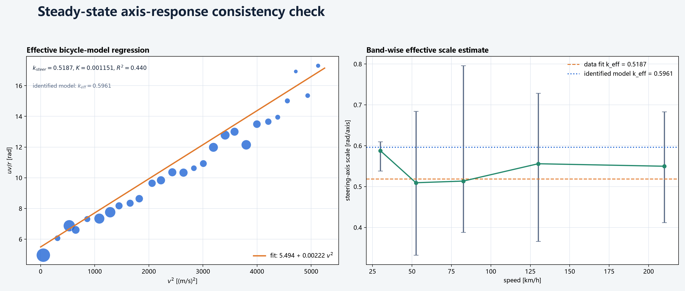

# 赛车自动驾驶规划与控制技术总结

## 1. 项目范围

本项目在 Assetto Corsa 中搭建了一套从赛道信息、赛车线规划、速度规划到横向与纵向 MPC 控制的完整闭环，并在上海、浙赛和纽北三条赛道上完成验证。


系统的核心链路是：

```text
Assetto Corsa
  -> shared memory
  -> VehicleState
  -> Frenet 投影与参考线
  -> 横向 LMPC + 纵向 MPC
  -> 虚拟 X360 转向/油门/刹车
  -> Assetto Corsa
```

控制周期为 50 Hz。横向 LMPC 使用 `20 x 20 ms` 预测窗口，最终纵向 MPC 使用 `50 x 50 ms` 预测窗口。


## 2. 闭环接口与实时信号

### 2.1 AC 共享内存

程序读取三个 AC 标准共享内存页：

| Page | 内容 |
| --- | --- |
| `acpmf_physics` | 车速、发动机、踏板、转向、轮胎、载荷、滑移、速度、角速度和加速度 |
| `acpmf_graphics` | 世界坐标、归一化赛道位置、圈数、出界状态、维修区和路面抓地力 |
| `acpmf_static` | 车型、赛道、布局和车辆静态参数 |

共享内存只有在 `packetId` 持续变化时才被视为有效，避免 AC 退出后残留的旧数据被当成实时状态。

### 2.2 `VehicleState`

控制器使用的核心状态包括：

| 类别 | 信号 |
| --- | --- |
| 时间与状态 | `timestamp`, `packet_id`, `status`, `completed_laps` |
| 运动状态 | `speed_kmh`, `position`, `heading_rad`, `yaw_rate_rad_s` |
| 速度与加速度 | 世界速度、车体局部速度、三轴加速度 |
| 执行器状态 | `gas`, `brake`, `steer`, `gear`, `rpm` |
| 轮胎状态 | 四轮角速度、垂直载荷、滑移、出界数量和路面抓地力 |
| 赛道信息 | `normalized_position`, `track`, `track_configuration` |

### 2.3 控制输入

控制器通过虚拟 Xbox 360 手柄输出：

- 左摇杆 X：转向。
- 左扳机：刹车。
- 右扳机：油门。

输入层同时支持 vJoy 和键盘 PWM，但最终赛道验证使用 `vgamepad`。虚拟手柄接口的优点是可以直接复用 AC 的车载输入链路，不需要修改 AC 本体。

## 3. 路径与速度规划


### 3.1 赛道几何

项目从 AC 的 `fast_lane.ai` 读取参考线，并提取：

- 中心线或快速参考线。
- 左右赛道宽度。
- 离散路径长度与累计弧长。
- 航向角和曲率。
- 起点到闭环的投影关系。

路径会重采样到约 `2 m` 间距，并使用三次样条保持闭环几何连续。

### 3.2 赛车线优化

规划器先按曲率识别弯道，把每个弯道划分为连续窗口。之后使用 L-BFGS-B 优化路径横向偏移：

$$
J =
t_{\text{lap}}
+ w_\kappa \sum_i \kappa_i^2 \Delta s_i
+ w_c \sum_i \max(0, c_{\text{target}} - c_i)^2 \Delta s_i
+ w_s \sum_i \|\Delta^2 o_i\|^2 .
$$

其中：

- $t_{\text{lap}}$ 是静态积分得到的圈速代理。
- $\kappa_i$ 是路径曲率。
- $c_i$ 是参考线到左右边界的距离。
- $o_i$ 是横向偏移。
- 曲率、边界和偏移平滑分别由 $w_\kappa$、$w_c$、$w_s$ 加权。

每圈结束后，规划器根据横向误差、航向误差、转向活动和出界情况决定是否扩大或回退弯道偏移。若新几何的估计圈速变差超过阈值，则拒绝本次更新。

### 3.3 曲率限速

基础曲率限速为：

$$
v_\kappa = \min\left(
v_{\max},
\max\left(
v_{\min},
\sqrt{\frac{a_{\text{lat,plan}}}{|\kappa|}}
\right)
\right).
$$

随后执行：

1. 周期平滑，并取平滑值与原始值中的较小值。
2. 前向加速约束。
3. 后向制动约束。
4. 可选摩擦椭圆约束。

后向制动约束形式为：

$$
v_i^2 \le v_{i+1}^2 + 2a_{\text{brake}}\Delta s_i.
$$

当摩擦椭圆启用时，纵向和横向能力按：

$$
\left(\frac{a_x}{a_{x,\max}}\right)^2+
\left(\frac{a_y}{a_{y,\max}}\right)^2 \le 1
$$

修正。

### 3.4 分速度带增益

每个赛道使用 9 个速度带的倍率表。最终配置为：

| Track | Speed scale by band |
| --- | --- |
| Shanghai | `1.00, 1.16, 1.28, 1.375, 1.375, 1.375, 1.31, 1.33, 1.33` |
| Zhejiang | `1.16, 1.23, 1.24, 1.28, 1.29, 1.29, 1.31, 1.33, 1.33` |
| Nordschleife | `1.00, 1.16, 1.28, 1.375, 1.375, 1.375, 1.31, 1.33, 1.33` |

倍率后的速度仍受总速度上限和曲率上限约束：

$$
v_{\text{scaled}} \le
\sqrt{\frac{a_{\text{lat,scaled}}}{|\kappa|}}\cdot 3.6.
$$

### 3.5 高速制动提前量

高速下控制器额外增加规划响应时间：

$$
\tau_{\text{effective}} =
\tau_{\text{response}}
+ \max(0, v-200)g_{\text{hs}}.
$$

上海 V64 和纽北安全版使用：

$$
g_{\text{hs}}=0.004\ \text{s/(km/h)}.
$$

制动允许速度按前向距离和制动能力限制：

$$
v_{\text{allowed}}^2 \le
v_{\text{ahead}}^2+2a_{\text{brake}}d_{\text{effective}}.
$$

### 3.6 横向与纵向耦合方式

本项目的“联合速度规划”不是把横向和纵向合并成一个六自由度联合 NLP，而是显式耦合的协调架构：

- 曲率速度包络和速度倍率决定纵向 MPC 的未来速度参考。
- 横向 MPC 的当前转向和横向加速度输入 `combined_braking_scale()`，缩放纵向 MPC 的可用制动能力。
- 高速响应时间补偿进一步提前制动目标。
- 横向载荷会同时增加纵向 MPC 的加速度和 jerk 代价，降低强横向载荷下的纵向激进程度。
- 纵向 MPC 输出加速度，踏板映射器再结合转向、滑移和速率限制输出油门或刹车。


曲率速度、速度倍率和倍率后抓地上限分别为：

$$
v_{\kappa,i}
=
\min\left(
v_{\max},
\max\left(
v_{\min},
\sqrt{\frac{a_{\mathrm{lat,plan}}}{|\kappa_i|}}
\right)
\right),
$$

$$
v_{s,i}
=
\min\left(
v_{\kappa,i}s(v_{\kappa,i}),
\sqrt{\frac{a_{\mathrm{lat,cap}}}{|\kappa_i|}}
\right).
$$

高速制动预瞄和有效制动距离为：

$$
\tau_{\mathrm{eff}}
=
\tau_0
+ \max(0,v_i-200)g_{\mathrm{hs}},
$$

$$
d_{\mathrm{eff}}
=
\max(0,d_i-v_i\tau_{\mathrm{eff}})
+ d_{\mathrm{lead}}.
$$

横向载荷和转向量共同缩放制动能力：

$$
u_b
=
\max\left(
\frac{|\delta|}{\delta_{\max}},
\frac{|a_y|}{a_{y,\mathrm{ref}}}
\right),
\qquad
\gamma_b
=
\sqrt{\max(0.25,1-u_b^2)},
\qquad
a_{\mathrm{brake,eff}}
=
a_{\mathrm{brake}}\gamma_b.
$$

纵向预览先由前向加速度约束生成：

$$
v_{\mathrm{ref},k}
=
\min\left(
v_{\mathrm{ref},k-1}+a_{\mathrm{accel}}\Delta t,
v_{s,k}
\right),
$$

再从后向前施加制动约束：

$$
v_{\mathrm{ref},k}
=
\min\left(
v_{\mathrm{ref},k},
\sqrt{v_{\mathrm{ref},k+1}^2
+2a_{\mathrm{brake,eff}}\Delta s_k}
\right).
$$

横向载荷与速度同时缩放纵向 MPC 的代价权重：

$$
r_a
=
r_{a,0}s_a(v)s_a(|a_y|),
\qquad
r_j
=
r_{j,0}s_j(v)s_j(|a_y|).
$$

因此，当前实现是“共享状态和约束参数的两层 MPC 协调”，不是单个同时求解横向和纵向的联合优化器。这个区别会影响后续扩展：如果实车需要显式联合摩擦圆约束，可以把制动缩放提升为联合 MPC 的约束项。

## 4. 横向 LMPC


### 4.1 Frenet 状态与为什么使用它

车辆被投影到参考路径的 Frenet 坐标系，状态定义为：

$$
x =
\begin{bmatrix}
e_y & e_\psi & v_x & v_y & r
\end{bmatrix}^{T},
\qquad
u =
\begin{bmatrix}
\delta & a_x
\end{bmatrix}^{T}.
$$

设参考路径为 $\mathbf r(s)$，其单位切向量和法向量分别为
$\mathbf t(s)$ 和 $\mathbf n(s)$。车辆位置先投影到最近路径点，
再将位置和航向表示为

$$
\mathbf p=\mathbf r(s)+e_y\mathbf n(s),
\qquad
e_\psi=\psi-\psi_{\mathrm{ref}}(s).
$$

其中 $e_y$ 是带符号横向误差，$e_\psi$ 是相对路径切线的航向误差。
$v_x$、$v_y$ 和 $r$ 仍保留在车体坐标系中，所以状态同时包含“赛道相对误差”
和“车辆自身动态”两类信息。

这里的 $\delta$ 是模型层面的有效转向输入。名义自行车模型中它表示前轮转角；
辨识后的线性模型直接使用归一化转向轴，并把量纲和游戏内部转向映射全部吸收到
速度调度的输入增益中。6.1 节会说明为什么在没有独立物理转角量测时，
再拆出一个“轴到物理转角”的比例是数学上不可辨识的。

使用 Frenet 坐标有三个直接原因。

1. 控制器真正关心的是赛道相对误差，而不是世界坐标中的绝对位置。
   路肩边界、赛车线偏移和目标路径都可以直接写成 $e_y$ 的约束；
   在笛卡尔坐标里，同样的边界需要每帧重新搜索最近点，并且约束会随赛道位置变化。
2. 曲率可以自然进入预测模型。参考路径在 $s$ 处的稳态横摆角速度为
   $r_{\mathrm{ref}}=v_x\kappa$，因此规划器给出的曲率可以直接变成 MPC 的前馈项。
   世界坐标本身并不携带赛道曲率，仍需要在控制器内部重新估计。
3. 在赛车线附近，$e_y$、$e_\psi$、$v_y$ 和 $r$ 都是围绕参考状态的小量，
   可以按速度段线性化并预计算矩阵，随后把预测写成小型 condensed QP。
   这套结构比在每个控制周期内求解完整非线性世界坐标模型更适合 50 Hz 闭环。

代码中的路径投影使用连续线段而不是直接取最近的离散索引，并传入上一帧索引
`previous_index` 保持跨起点和不同圈数的投影连续性。代价是模型依赖两个假设：
横向误差满足 $|e_y\kappa|<1$，且路径切线与车辆航向的夹角较小。
当车辆已经远离赛道或参考路径出现尖角时，小角度 Frenet 模型会失真；
因此工程实现仍保留投影有效性检查和降级控制器。

### 4.2 从非线性车辆模型到五状态连续模型

五状态模型不是直接拟合出来的经验方程，而是从平面自行车模型逐步线性化得到的。
忽略空气阻力和载荷转移时，车体坐标下的横向与横摆动力学为：

$$
m(\dot v_y+v_xr)=F_{yf}+F_{yr},
$$

$$
I_z\dot r=aF_{yf}-bF_{yr}.
$$

其中 $a$ 和 $b$ 分别是质心到前、后轴的距离，$F_{yf}$ 和 $F_{yr}$
分别是前、后轴侧向力。前后轮侧偏角近似为：

$$
\alpha_f\approx\delta-\frac{v_y+ar}{v_x},
\qquad
\alpha_r\approx-\frac{v_y-br}{v_x}.
$$

在线性侧偏区间内使用
$F_{yf}=C_f\alpha_f$ 和 $F_{yr}=C_r\alpha_r$，可得名义模型：

$$
\dot v_y=
-\frac{C_f+C_r}{mv_x}v_y
+\left(\frac{bC_r-aC_f}{mv_x}-v_x\right)r
+\frac{C_f}{m}\delta,
$$

$$
\dot r=
\frac{bC_r-aC_f}{I_zv_x}v_y
-\frac{a^2C_f+b^2C_r}{I_zv_x}r
+\frac{aC_f}{I_z}\delta.
$$

写成速度调度的紧凑形式：

$$
\dot v_y=a_{33}(v_x)v_y+a_{34}(v_x)r+b_{31}(v_x)\delta,
$$

$$
\dot r=a_{43}(v_x)v_y+a_{44}(v_x)r+b_{41}(v_x)\delta.
$$

$(a_{33},a_{34},a_{43},a_{44})$ 是状态的阻尼和耦合项，
$(b_{31},b_{41})$ 是单位转向输入对横向速度和横摆角加速度的增益。
名义自行车模型给出它们的轮胎刚度表达式；最终控制器则允许用速度带辨识结果
覆盖这些系数，以反映模拟器轮胎、悬架和转向系统的综合响应。

在 Frenet 坐标下，横向误差和航向误差的动态为：

$$
\dot e_y
=v_x\sin e_\psi+v_y\cos e_\psi
\approx v_xe_\psi+v_y,
$$

$$
\dot e_\psi
=r-\frac{v_x\kappa}{1-e_y\kappa}
\approx r-v_x\kappa.
$$

线性 MPC 在预测时域内把每个速度段的 $v_x$ 视为近似常量，并把
$v_x\kappa$ 作为已知曲率前馈。纵向速度状态保留为：

$$
\dot v_x = a_x,
$$

于是得到五状态连续模型：

$$
\dot x=A_c(v_x)x+B_c(v_x)u,
\qquad
x=
\begin{bmatrix}
e_y & e_\psi & v_x & v_y & r
\end{bmatrix}^{T},
\qquad
u=
\begin{bmatrix}
\delta & a_x
\end{bmatrix}^{T}.
$$

这里每一段预测都使用规划速度计算 $A_c(v_x)$ 和 $B_c(v_x)$，
因此模型随速度变化，但每个速度桶内部的矩阵是固定的，可以缓存。
完整的 $A_c$、$B_c$ 矩阵和执行器增广形式见 4.7 节。

配置允许使用辨识得到的速度调度映射覆盖标准轮胎刚度系数：

$$
a_{33}=-\frac{c_{\text{lat}}(v_x)}{v_x},
$$

$$
a_{34}=\frac{c_{\text{lat,yaw}}(v_x)}{v_x}-v_x,
$$

$$
a_{43}=\frac{c_{\text{yaw,vel}}(v_x)}{v_x},
$$

$$
a_{44}=\frac{c_{\text{yaw,damp}}(v_x)}{v_x}.
$$

输入增益 $b_{31}$ 和 $b_{41}$ 同样按速度插值。高横向载荷时，横摆响应还会乘一个 load schedule：

```text
0.0 g -> 1.00
0.2 g -> 0.90
0.4 g -> 0.75
0.6 g -> 0.60
0.8 g -> 0.50
1.2 g -> 0.45
```

这用于表示轮胎接近附着极限时横摆响应下降。

### 4.3 转向执行器模型

当启用转向状态时，状态扩展为：

$$
\dot \delta =
\frac{\delta_{\text{cmd}}-\delta}{\tau_{\text{steer}}}.
$$

最终配置中的执行器时间常数为：

```text
steering_actuator_tau_s = 0.14
steering_filter_tau_s = 0.10
steering_lead_s = 0.03
steering_rate_limit = 2.0 rad/s
steering_jerk_limit = 8.0 rad/s^3
```

控制输出还会经过滤波、相位超前、执行器滞后修正、转向速率限制和转向 jerk 限制。

### 4.4 离散化与参考

连续模型通过前向欧拉离散：

$$
A_d=I+A_c\Delta t,
\qquad
B_d=B_c\Delta t.
$$

并限制离散系统谱半径，避免高速速度桶下的数值发散。

参考序列中：

$$
v_{y,\text{ref}}=0,
\qquad
r_{\text{ref}}=v_x\kappa.
$$

路径点按 `reference_preview_s` 和预测速度推进。最终上海配置使用 `0.16 s` 预瞄。

### 4.5 Cost function

横向 MPC 的二次代价函数为：

$$
J =
\sum_{k=0}^{N-1}
\left[
(x_k-x_{\text{ref},k})^{T}Q_k(x_k-x_{\text{ref},k})
+u_k^{T}R_ku_k
+(\Delta u_k)^{T}R_{d,k}\Delta u_k
\right]
+J_{\text{terminal}}.
$$

终端权重使用 `terminal_weight_scale = 4.0`。

状态权重：

$$
Q_k=\operatorname{diag}
\left(
q_y m_y(v),
q_\psi m_\psi(v),
q_{v_x},
q_{v_y},
q_r m_r(v)
\right).
$$

最终上海/浙赛配置使用：

```text
q_lateral = 30
q_heading = 30
q_speed = 2
q_lateral_velocity = 2
q_yaw_rate = 5
r_steer = 18
r_accel = 0.4
rd_steer = 520
rd_accel = 8
```

速度和载荷相关权重会分别缩放横向、航向、横摆、转向和转向速率项。

### 4.6 权重调度

权重不是一次性静态常数，而是由速度、横向载荷和纵向速度共同调度：

| 调度项 | 节点 | 最终倍率 |
| --- | --- | --- |
| 横向误差 $q_y$ | 0, 40, 80, 140, 220 km/h | 1.000, 1.276, 1.050, 0.700, 0.650 |
| 航向误差 $q_\psi$ | 0, 40, 80, 140, 220 km/h | 1.000, 1.217, 1.040, 0.950, 0.900 |
| 横摆角速度 $q_r$ | 0, 40, 80, 140, 220 km/h | 1.000, 1.469, 1.242, 1.150, 1.200 |
| 转向 $r_\delta$ | 0, 40, 80, 140, 220 km/h | 1.600, 2.645, 3.024, 3.500, 4.000 |
| 转向速率 $r_{\dot\delta}$ | 0, 40, 80, 140, 220 km/h | 1.600, 3.620, 3.680, 4.000, 5.000 |

纵向 MPC 使用两组调度：

| 调度项 | 节点 | 最终倍率 |
| --- | --- | --- |
| 加速度代价-横向载荷 | 0, 0.3, 0.6, 0.9, 1.2 g | 1.00, 1.10, 1.30, 1.55, 1.80 |
| Jerk 代价-横向载荷 | 0, 0.3, 0.6, 0.9, 1.2 g | 1.00, 1.20, 1.50, 1.90, 2.40 |
| 加速度代价-速度 | 0, 80, 140, 200, 260 km/h | 1.00, 1.05, 1.15, 1.30, 1.45 |
| Jerk 代价-速度 | 0, 80, 140, 200, 260 km/h | 1.00, 1.15, 1.40, 1.75, 2.00 |


速度越高，转向控制越平滑；横向载荷越大，纵向 MPC 越不愿意快速改变加速度或 jerk。这样可以减少高速修舵和强横向载荷下的纵向扰动。

### 4.7 线性模型矩阵与执行器增广

五状态模型的连续矩阵为：

$$
A_c=
\begin{bmatrix}
0 & v_x & 0 & 1 & 0\\
0 & 0 & 0 & 0 & 1\\
0 & 0 & 0 & 0 & 0\\
0 & 0 & 0 & a_{33} & a_{34}\\
0 & 0 & 0 & a_{43} & a_{44}
\end{bmatrix},
\quad
B_c=
\begin{bmatrix}
0 & 0\\
0 & 0\\
0 & 1\\
b_{31} & 0\\
b_{41} & 0
\end{bmatrix}.
$$

加入转向执行器状态 $\delta$ 后，状态扩展为

$$
x_{\mathrm{aug}}=
\begin{bmatrix}
e_y & e_\psi & v_x & v_y & r & \delta
\end{bmatrix}^{T},
$$

$$
\dot x_{\mathrm{aug}}
=A_{\mathrm{aug}}x_{\mathrm{aug}}
+B_{\mathrm{aug}}
\begin{bmatrix}\delta_{\mathrm{cmd}} & a_x\end{bmatrix}^{T},
$$

其中

$$
A_{\mathrm{aug}}=
\begin{bmatrix}
0 & v_x & 0 & 1 & 0 & 0\\
0 & 0 & 0 & 0 & 1 & 0\\
0 & 0 & 0 & 0 & 0 & 0\\
0 & 0 & 0 & a_{33} & a_{34} & b_{31}\\
0 & 0 & 0 & a_{43} & a_{44} & b_{41}\\
0 & 0 & 0 & 0 & 0 & -1/\tau_{\mathrm{steer}}
\end{bmatrix}.
$$

$$
B_{\mathrm{aug}}=
\begin{bmatrix}
0 & 0\\
0 & 0\\
0 & 1\\
0 & 0\\
0 & 0\\
1/\tau_{\mathrm{steer}} & 0
\end{bmatrix}.
$$

也就是说，转向指令不再直接当作即时前轮转角，而是先驱动执行器状态 $\delta$；$\delta$ 再通过 $b_{31}$ 和 $b_{41}$ 影响车辆。最终离散模型为：

$$
A_d=I+A_{\mathrm{aug}}\Delta t,
\qquad
B_d=B_{\mathrm{aug}}\Delta t.
$$

### 4.8 约束

主要约束包括：

- 转向位置上下限。
- 转向速率限制。
- 转向 jerk 限制。
- 横向加速度和纵向加速度上下限。
- 转向执行器状态限制。

控制问题转换为 condensed QP，并使用 OSQP 在线求解。若 QP 失败，控制器保留上一帧转向命令，而不是输出不可信解。

## 5. 纵向 MPC

### 5.1 模型

纵向模型从“速度受驱动力、制动力和滑行阻力共同作用”这一非线性关系出发：

$$
\dot v=a_x-a_{\mathrm{coast}}(v),
$$

其中 $a_x$ 是驱动力或制动力产生的纵向加速度，
$a_{\mathrm{coast}}(v)$ 是从实测滑行数据拟合得到的速度相关阻力减速度。
踏板、发动机、变速箱和制动液压系统不会瞬时达到目标加速度，因此再加入一阶执行器响应：

$$
\dot a=\frac{u-a}{\tau_a},
$$

其中 $u$ 是目标加速度，$a$ 是实际加速度状态，$\tau_a$ 是响应时间常数。
使用前向欧拉离散：

$$
\alpha=\frac{\Delta t}{\tau_a},
$$

$$
a_{k+1}=(1-\alpha)a_k+\alpha u_k,
\qquad
0\leq\alpha\leq1,
$$

$$
v_{k+1}=v_k+\Delta t\left(a_{k+1}-a_{\text{coast}}(v_k)\right).
$$

写成状态空间形式：

$$
\begin{bmatrix}
v_{k+1}\\
a_{k+1}
\end{bmatrix}
=
\underbrace{
\begin{bmatrix}
1 & \Delta t(1-\alpha)\\
0 & 1-\alpha
\end{bmatrix}}_{A_{\mathrm{lon}}}
\begin{bmatrix}
v_k\\
a_k
\end{bmatrix}
+
\underbrace{
\begin{bmatrix}
\Delta t\alpha\\
\alpha
\end{bmatrix}}_{B_{\mathrm{lon}}}
u_k
+
\begin{bmatrix}
-\Delta t\,a_{\mathrm{coast}}(v_k)\\
0
\end{bmatrix}.
$$

这里 $u_k$ 是绝对目标加速度。QP 控制量使用增量
$\Delta u_k=u_k-u_{k-1}$，所以 jerk 惩罚可以直接写成
$\Delta u_k^2$；展开后的控制序列仍受绝对加速度和 jerk 上下限约束。
这种结构把复杂的动力系统压缩为一个一阶响应和实验标定表，
既保留了加速、制动和滑行的主要动态，也保持了实时 QP 的可解性。

### 5.2 Cost function

$$
J =
\sum_{k=0}^{N-1}
\left[
q_v(v_k-v_{\text{ref},k})^2
+q_a(a_k-a_{\text{ref},k})^2
+r_a\Delta a_k^2
+r_j\Delta^2 a_k^2
\right].
$$

最终配置中的关键参数：

```text
horizon = 50
dt = 0.05 s
response_tau_s = 0.08847 s
q_speed = 12
q_accel = 3
r_accel = 1.2
r_jerk = 70
max_accel = 5.0 m/s^2
max_brake = 19.6 m/s^2
max_jerk = 7.6 m/s^3
max_brake_jerk = 39.9 m/s^3
```

加速度与 jerk 的代价会随横向载荷和速度增大，使 MPC 在弯中更加平滑。

### 5.3 约束

纵向控制输入满足：

$$
-a_{\text{brake,max}} \le a_k \le a_{\text{accel,max}},
$$

$$
-j_{\text{brake,max}}\Delta t
\le \Delta a_k \le
j_{\text{accel,max}}\Delta t.
$$

在赛道规划层，每个点的允许减速度还根据速度带、路面抓地力和车辆当前横向载荷限制。

### 5.4 踏板映射

MPC 输出的是目标加速度，不是直接踏板百分比。油门和刹车由实测能力映射得到：

$$
T =
\operatorname{clamp}
\left(
\frac{a_{\text{propulsion}}}
{a_{\text{accel,capability}}(v)},
0,1
\right),
$$

$$
B =
\operatorname{interp}
\left(
v, a_{\text{decel,request}}
\right).
$$

刹车映射使用速度点和踏板点构成二维表，并在速度方向和踏板方向之间线性插值。最终踏板映射还包括：

- 油门上升和下降速率限制。
- 刹车上升和下降速率限制。
- 转向时降低油门。
- 轮胎滑移过大时削减油门。
- 油门和刹车同时输出时互斥。

## 6. 标定与模型辨识


### 6.1 归一化输入轴与转向标定的可辨识性

最终 LMPC 的控制输入是 AC/vGamepad 的归一化转向轴
$\delta_{\mathrm{axis}}\in[-1,1]$，不是独立测得的物理前轮转角。
这只是一个输入量纲选择，不会改变模拟器内部实际执行的转向，也不会改变车辆响应。

| 方法 | 输入 | 估计对象 | 服务对象 |
| --- | --- | --- | --- |
| 横向动力学辨识 | 归一化转向轴及车辆状态时序 | 完整的轴输入到横向、横摆响应映射 | 直接构造 LMPC 预测模型 |
| 稳态转向检查 | 同一归一化转向轴及稳态响应 | 等效 $k_{\mathrm{eff}}$、$K_{\mathrm{eff}}$ | 趋势解释与一致性检查 |

动态辨识直接使用时间序列中的加速度和角加速度。以归一化转向指令
$\delta_{\mathrm{axis}}$ 为输入时，拟合模型为：

$$
\dot v_y+v_xr
=c_1\left(-\frac{v_y}{v_x}\right)
+c_2\delta_{\mathrm{axis}}+c_3,
$$

$$
\dot r
=c_4\frac{v_y}{v_x}
+c_5\frac{r}{v_x}
+c_6\delta_{\mathrm{axis}}+c_7.
$$

这些系数已经包含轮胎侧偏刚度、载荷转移、游戏内部转向映射和执行器响应。
如果另行假设一个物理前轮转角

$$
\delta_{\mathrm{road}}=k\delta_{\mathrm{axis}},
$$

并把它代入物理自行车模型，则辨识得到的轴输入增益为

$$
b_{\mathrm{axis}}(v)=k(v)b_{\mathrm{road}}(v).
$$

如果只有 $\delta_{\mathrm{axis}}$、横摆角速度和横向加速度，$k(v)$ 与
$b_{\mathrm{road}}(v)$ 的乘积才是可观测的，二者不能分别辨识。
因此转向轴归一化不会影响实际转角，只是选择了模型输入坐标；
横向动力学辨识在数学上已经吸收了转向轴比例。

所谓稳态转向标定，是把同一组轴输入和稳态响应投影到
$uv/r=a+bv^2$ 的二参数自行车关系上：

$$
k_{\mathrm{eff}}=\frac{L}{a},
\qquad
K_{\mathrm{eff}}=bk_{\mathrm{eff}}.
$$

它适合解释车辆的稳态不足转向趋势，也可以作为模型一致性检查，
但它不是与横向动力学辨识并列的独立模型，更不能在没有独立物理转角量测时
被解释成真实转向系统的标定结果。

只有以下情况才需要真正独立的转向标定：

- 有独立传感器测量前轮转角，能够将轴信号和物理转角解耦。
- 需要做跨车辆归一化、线控执行器限位或实车迁移。
- 游戏或实车的轴到转角存在明显非线性、死区和饱和，需要单独建立静态输入映射。

当前冻结的线性 LMPC 直接使用 `b_lat`、`b_yaw` 等轴输入增益。
配置中的 `steering_scale_map` 不参与线性 MPC 的 A/B 矩阵构建和最终转向输出换算，
因此不能把它描述为“由物理转角标定得到的 MPC 模型参数”。

### 6.2 横向动力学辨识

`tools/identify_mpc_model.py` 和 `tools/fit_calibrated_dynamics.py` 使用低滑移、四轮在界内、路面抓地力正常的样本。

Clean-sample 条件包括：

```text
lap >= configured first lap
0.005 s <= dt <= 0.10 s
vx > 5 m/s
abs(vy) < 15 m/s
abs(yaw_rate) < 1.5 rad/s
abs(steer) < 0.95 * max_steer
tyres_out == 0
surface_grip >= 0.85
```

横向速度导数模型：

$$
\dot v_y+v_x r =
c_1\left(-\frac{v_y}{v_x}\right)
+c_2\delta+c_3.
$$

横摆角加速度模型：

$$
\dot r =
c_4\frac{v_y}{v_x}
+c_5\frac{r}{v_x}
+c_6\delta+c_7.
$$

系数按速度带拟合后再插值成速度调度表。`configs/models/lmpc_calibrated_model_v10.json` 中五个速度带的横向拟合 $R^2$ 为：

| Speed band | Lateral R² |
| --- | ---: |
| 40-70 km/h | 0.979 |
| 70-100 km/h | 0.986 |
| 100-130 km/h | 0.986 |
| 130-160 km/h | 0.976 |
| 160-200 km/h | 0.989 |



最终辨识结果：

| Speed band | Samples | c_lat | c_yaw,vel | c_yaw,damp | b_lat | b_yaw | Lateral R² | Yaw R² |
| --- | ---: | ---: | ---: | ---: | ---: | ---: | ---: | ---: |
| 40-70 | 6205 | 212.98 | 28.37 | -254.70 | 72.60 | 42.77 | 0.979 | 0.923 |
| 70-100 | 5969 | 322.30 | 36.10 | -249.86 | 81.27 | 41.48 | 0.986 | 0.894 |
| 100-130 | 3773 | 332.79 | 44.76 | -234.27 | 76.94 | 40.76 | 0.986 | 0.913 |
| 130-160 | 1540 | 312.83 | 42.36 | -241.01 | 72.68 | 43.04 | 0.976 | 0.972 |
| 160-200 | 1497 | 319.38 | 43.20 | -241.90 | 73.08 | 42.91 | 0.989 | 0.951 |

表中 `c_yaw,damp` 为负值，因为该项表示横摆角速度的阻尼；`b_lat` 和 `b_yaw` 分别表示单位归一化转向输入产生的横向加速度和横摆角加速度增益。

### 6.3 转向稳态一致性检查

`tools/calibrate_steering.py` 在低速滑板和高速直道上执行正弦转向扫描，记录指令轴、实际转向、横摆角速度、横向加速度、局部速度和轮胎滑移。

在固定轴距 $L=2.85$ m 和线性自行车模型假设下，稳态数据可以投影为：

$$
\frac{u v}{r}=a+bv^2,
\qquad
k_{\mathrm{eff}}=\frac{L}{a},
\qquad
K_{\mathrm{eff}}=bk_{\mathrm{eff}}.
$$

最终高速标定日志筛选后得到约 `3332` 个有效样本：

| 稳态检查结果 | Value |
| --- | ---: |
| Effective axis scale $k_{\mathrm{eff}}$ | 0.5187 rad/axis |
| Derived understeer gradient $K_{\mathrm{eff}}$ | 0.001151 |
| Fit intercept a | 5.494 |
| Fit slope b | 0.002219 |



图中左图使用分箱后的稳态中位数降低高频噪声，拟合仍对过滤后的全部样本执行。右图给出各速度带的等效尺度中位数和 p10-p90 范围，并和最终辨识模型的稳态投影进行比较。最终辨识模型在 `20-240 km/h` 上投影得到
$k_{\mathrm{eff}}\approx0.596$、$K_{\mathrm{eff}}\approx0.00149$；
两者数值接近但不完全相同，差异来自样本窗口、速度带插值和高横向载荷下的模型修正。

这里的 $k_{\mathrm{eff}}$ 不是独立测得的物理前轮转角比例，而是“在给定自行车模型和轴距后，归一化轴信号等效于多大前轮转角”的稳态尺度。它与动态辨识共享同一输入输出信息，因此主要作为一致性检查和可解释统计量，而不是 MPC 的额外必需标定。

### 6.4 纵向制动表

纵向能力来自踏板-减速度实测。标定时保持固定初始速度，对油门或刹车施加分级输入，记录稳态减速度，并形成 `速度 x 踏板` 表。

最终标定表覆盖：

- 速度点：`0, 30, 60, 90, 120, 160, 200, 260 km/h`。
- 踏板点：`0, 0.15, 0.30, 0.45, 0.60, 0.75, 0.90, 1.00`。
- 实测减速度范围约为 `0-17.19 m/s²`。

控制器在车速和踏板两个方向做插值，再结合 MPC 输出的目标减速度生成刹车命令。

### 6.5 速度增益标定

速度增益不是直接从单次人工圈复制，而是结合：

- 路径曲率。
- 人工示教速度包络。
- 赛道边界和横向误差。
- 每圈出界情况。
- 纵向加速和制动能力。
- 圈速与稳定性反馈。

最终倍率表按速度带保存，并且每次修改只调整一个速度带，避免整张速度表同时漂移。

## 7. 实测结果


### 7.1 上海

| Item | Value |
| --- | ---: |
| Human | 2:16.248 |
| Auto | 2:23.543 |
| Gap | +0:07.295 |
| Auto max speed | 268.7 km/h |
| p95 lateral error | 0.566 m |
| Tyres out | 0 |

自动车在大直道上接近人工驾驶，但在部分中低速弯的入弯和出弯速度不足。主要差距区段约为：

- `1.45-1.50 km`
- `2.95-3.05 km`
- `4.60-4.70 km`


### 7.2 浙赛

| Item | Value |
| --- | ---: |
| Human | 1:34.329 |
| Auto | 1:43.764 |
| Gap | +0:09.436 |
| Auto max speed | 229.2 km/h |
| p95 lateral error | 0.535 m |
| Tyres out | 2 |

浙赛自动圈与人工圈的差距主要来自弯中速度和出弯加速。自动车的横摆角速度更平滑，但横向加速度峰值通常比人工低约 `0.2-0.4 g`。


### 7.3 纽北

V2 safe 版本第一次完整跑完纽北：

| Item | Value |
| --- | ---: |
| Human reference lap | 7:17.632 |
| Automatic lap | 8:46.825 |
| Gap | +1:29.193 |
| Max speed | 293.8 km/h |
| Mean speed | 143.6 km/h |
| p95 lateral error | 0.461 m |
| Max lateral error | 1.877 m |
| Tyres out | 0 |

剩余瓶颈是纵向速度执行，而不是横向稳定性。高速度段的 p95 目标速度差达到 `50-87 km/h`，说明整车动力、阻力模型、目标速度恢复斜率或纵向执行能力仍需要继续优化。


## 8. 项目解决的关键问题

### 1. 实时闭环和残旧共享内存

问题：AC 退出后共享内存可能仍然存在，直接读取会把旧帧当成实时状态；键盘 PWM 也无法提供连续转向和踏板。

解决：使用 `packetId` 变化判断 AC 是否仍处于实时状态，输入层切换为 vJoy/vgamepad 连续控制，并对 AC 窗口焦点和控制器释放做统一处理。

### 2. 横向模型失配与转向延迟

问题：标准自行车模型对模拟器车辆的高速横摆响应和转向执行器延迟描述不足，导致高速振荡和弯中修舵。

解决：按速度带辨识横向和横摆模型，加入载荷相关横摆衰减，建立转向执行器一阶模型，并使用滤波、超前和滞后补偿。

### 3. 油门、刹车和减速度映射

问题：单纯 PI 速度控制器无法处理制动力、滑行阻力和高速度下的执行器差异。

解决：采集踏板-减速度实测表，建立 coast-down 阻力映射，改用纵向增量 MPC，并加入加速度、jerk 和横纵载荷相关权重。

### 4. 纽北布局解析错误

问题：控制器最初读取了 `ks_nordschleife\endurance\ai\fast_lane.ai`，而车辆实际运行在普通 `nordschleife` 布局。虽然赛道名称相同，但起点附近路线不同，车辆在约 `14.6 s` 处突然撞墙。

解决：当共享内存没有提供布局名时，从 `Documents/Assetto Corsa/cfg/race.ini` 读取 `CONFIG_TRACK`，并按实际布局解析快速参考线。

### 5. 赛车线边界余量不足

问题：纽北某一位置参考线距离右侧边界仅约 `0.40 m`，小于车身半宽。即使横向误差为零，也会压草或出界。

解决：增加硬边界投影，保证最终参考线的目标余量；当局部宽度不足时，将参考线向可用一侧重新投影，并在平滑后再次执行边界约束。

### 6. 速度倍率突破抓地力

问题：局部曲率速度经过倍率放大后，目标侧向加速度达到约 `1.0-1.23 g`，超过当前车辆和路面的可用能力。

解决：在速度倍率之后增加曲率限速，使：

$$
v \le \sqrt{\frac{a_{\text{scaled}}}{|\kappa|}}\cdot 3.6.
$$

纽北安全版使用 `1.02 g` 的倍率后上限、`1.2 m` 参考线余量和 `0.65 g` 基础规划横向加速度，最终实现四轮不出界的完整圈。

## 9. 自动车与人工驾驶的差异

自动车表现更好的部分：

- 横向轨迹更平滑，横摆角速度的突变较少。
- 同一配置多次重复性高，浙赛四圈的差异只有几十毫秒。
- 高速制动和路径跟踪不受驾驶疲劳影响。
- 在部分上海中速区段，自动车速度比人工高约 `7-12 km/h`。

仍然不足的部分：

- 自动车没有充分利用可用横向抓地力，弯中和出弯速度偏低。
- 出弯加速通常比人工晚，尤其在浙赛中低速弯。
- 速度增益表和控制权重仍偏保守，圈速换取稳定性。
- 纵向模型对高速度和动力系统能力的描述还不完整。

## 10. 扩展到实车

可直接复用的部分：

- Frenet 投影、路径重采样、曲率和速度包络。
- 赛车线和边界安全投影。
- 横向 LMPC、纵向 MPC 和标定/辨识流程。
- 日志、圈次分析和离线回放工具。

必须替换或强化的部分：

- 用 RTK-GNSS、IMU、轮速和车辆状态估计替换 AC 真值。
- 用 CAN/线控执行器替换虚拟手柄。
- 重新辨识质量和惯量、轮胎刚度、载荷转移、制动和动力能力。
- 增加独立安全限制、紧急停车、冗余、看门狗和驾驶员接管。
- 在低风险测试场地逐步验证，禁止直接把仿真参数用于实车闭环。

完整说明见 `docs/REAL_CAR_TRANSFER.md`。

## 11. 复现实验

安装依赖并运行测试：

```powershell
python -m pip install -r requirements.txt
python -m unittest discover -s tests -v
```

重新生成人类对比图和项目总览图：

```powershell
python -m tools.build_comparison_figures
python -m tools.build_project_assets
```

运行指定赛道配置：

```powershell
.\tools\start_v64_shanghai.ps1
.\tools\start_zhejiang_final.ps1
.\tools\start_nordschleife_v2_safe.ps1
```

完整环境准备和日志命令见 `docs/QUICKSTART.md`。

## 12. 当前边界

- 最终结果基于 Assetto Corsa，不代表实车性能。
- 浙赛最终同步配置尚未重新完成整圈验证。
- V64 上海是最终候选，验证圈速仍来自 V63。
- 纽北目前是安全验证版本，不是圈速最优版本。
- 原始日志和 vendored acados 不进入公开 Git 历史，使用最终模型文件和依赖清单复现。
